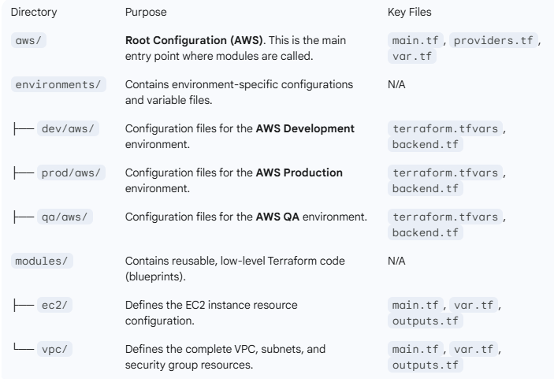

Multi-Environment Terraform Infrastructure

This repository manages cloud infrastructure (VPC, EC2) across multiple environments (Dev, QA, Prod) and clouds (AWS). It utilizes a standard Terraform pattern that separates reusable logic into Modules and environment-specific parameters into Environment folders.

Getting Started
Prerequisites
Terraform CLI installed (version 1.0+)

AWS CLI installed and configured with credentials or an appropriate IAM Role assumed.

Setup and Initialization
To work with any environment, you must initialize Terraform from the respective configuration directory (the one containing main.tf, which is the aws/ folder).

1. Navigate to the Root Configuration:
 cd aws

 Initialize Terraform: You must run init with the appropriate backend configuration file (backend.tf) from the desired environment.

Example for Dev Environment:
terraform init -backend-config="../environments/dev/aws/backend.tf"

🛠️ Deployment Instructions
All deployment commands (plan, apply, destroy) should be executed from the aws/ directory, using the -var-file flag to specify the environment variables.

1. Planning Changes (Dry Run)
Always run a plan before applying to see what changes Terraform will make.

Dev Environment Example:
terraform plan -var-file="../environments/dev/aws/terraform.tfvars"

Prod Environment Example:
terraform plan -var-file="../environments/prod/aws/terraform.tfvars"

2. Applying Changes
Apply the changes to provision the infrastructure.

Dev Environment Example:
terraform apply -var-file="../environments/dev/aws/terraform.tfvars"

3. Destroying Infrastructure
To tear down all resources for a specific environment. Use with caution, especially in prod!

Dev Environment Example:
terraform destroy -var-file="../environments/dev/aws/terraform.tfvars"

Key Design Decisions
Single Entry Point (aws/): The core logic (module calls) resides in one aws/main.tf file. This prevents configuration drift between environments.

Environment Isolation: Each environment (dev, qa, prod) uses its own dedicated terraform.tfvars file to define resource sizes, CIDR ranges, and tags. This ensures clean separation of variable inputs.

Variable Override: The use of -var-file allows the same aws/main.tf to be deployed differently based on the environment-specific variables provided.